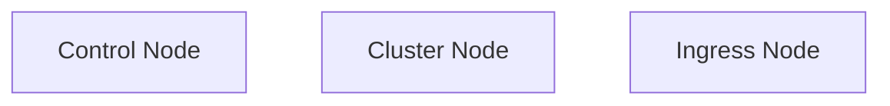
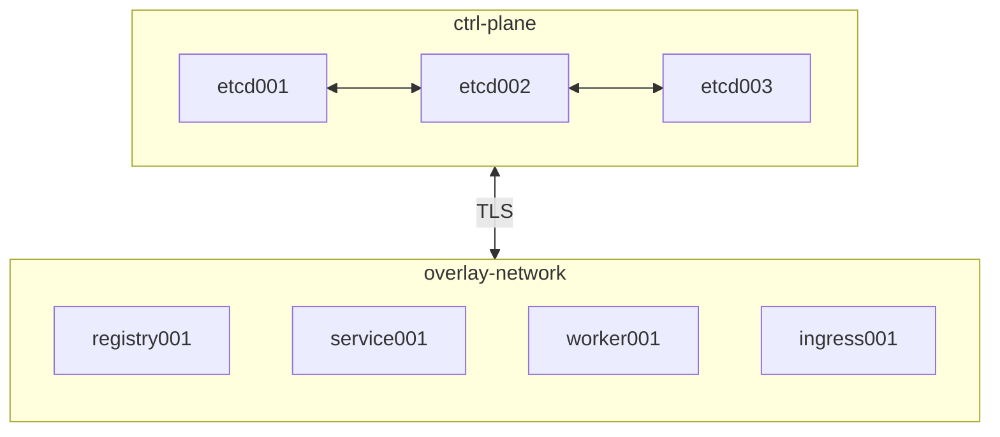
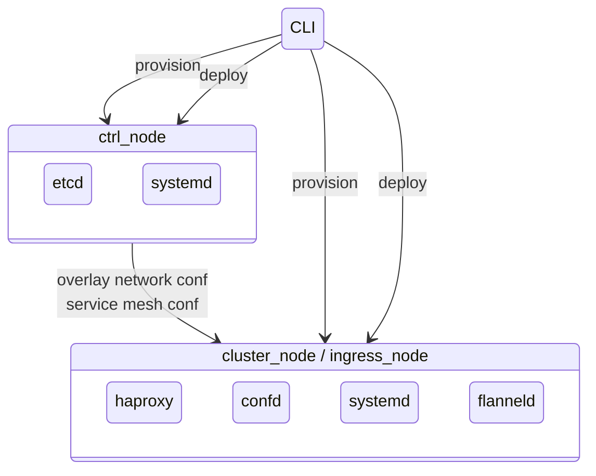

# nix-infra-test
This is a micro cluster setup for testing nix-infra. It is intended to allow you to try out nix-infra with minimal configuration. All you need is a Hetzner account and some super basic configuration.


Copy .env.in to .env and edit it:
- add path to your ssh-key -- to access the cluster
- add Hetzner management token -- to provision nodes
- chose some passwords for your local certificate authority
- add an e-mail for letsencrypt

In the folder `openssl/` you should edit both files:
- Edit section "# Optionally, specify some defaults."

Now you simply run the following scripts:
```sh
# Initialise you local cluster configuration repo
$ scripts/create.sh
# Configure the local container registry
$ scripts/deploy.sh registry001
# Publish your images to the registry
$ scripts/publish app_images/app-pod.tar.gz registry001
$ scripts/publish app_images/app-mongodb-pod.tar.gz registry001
# Deploy apps to your cluster
$ scripts/helpers/deploy.sh service001 worker001
```

Now you have two choices, either you run commands on ingress node to test your app...
```sh
$ scripts/cmd ingress001 "curl -s http://127.0.0.1:11211/ping"
$ scripts/cmd ingress001 "curl -s http://127.0.0.1:11311/ping"
```
...or you point a subdomain (CNAME) to the IP of the ingress node and configure `nodes/ingress001.nix` appropriately.

TODO: fix the ssh key path (~/.ssh/deis)
TODO: Read stuff from .env-file

## Node Types



The control node(s) make up the control plane and handles dynamic cluster state management such as:

- overlay network
- service mesh

This allows us to limit interaction with the specific nodes being changed during deployment and allow the cluster to automatically propagate changes to the other affected nodes in the cluster.

The worker nodes run databases and applications.

The ingress node(s) exposes the cluster to the internet.

## Cluster Topology



Orchestration and configuration of the cluster nodes is done over SSH directly to each target node. This allows parallell execution.

The overlay network is a Flanneld mesh network over a Wireguard encrypted network interface.

Services and applications are exposed over a service mesh through local haproxy loadbalancer. This can provide a fault tolerant setup when you deploy multiple instances of a service or app.



## Deploying an Application
Each node in the cluster has it's own configuration in the `nodes/` folder.

In this configuration you can configure what apps to run on that node and how you want them to be configured.

The actual deployment is done using the `deploy-apps` command and specifying the target nodes you want to update. All app configurations or the node will be affected.

### Publish an OCI-Image
Build you local image, get the image tag and run:
```sh
$ scripts/publish [image_name] [image_tag] registry001
```

The image will be uploaded to the private registry and is then available for deployment in your cluster.

### Secrets
To securely provide secrets to your application, store them using the CLI `secrets` command or as an output from a CLI `action`command using the option `--store-as-secret=[name]`.

The secret will be encrypted in your local cluster configuration directory. When deploying an application, the CLI will pass any required secrets to the target and store it as a systemd credential. Systemd credentials are automatically encrypted/decrypted on demand.

